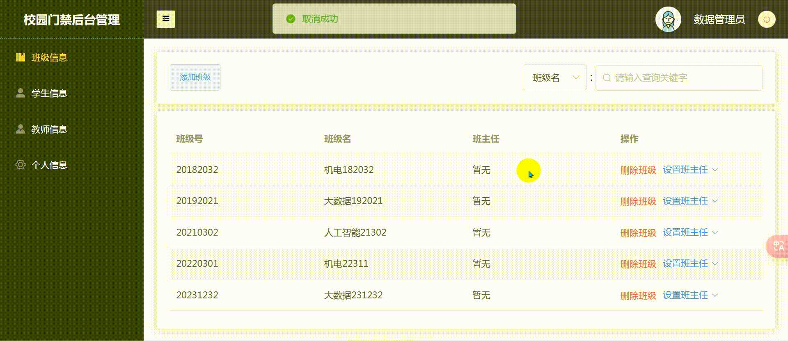
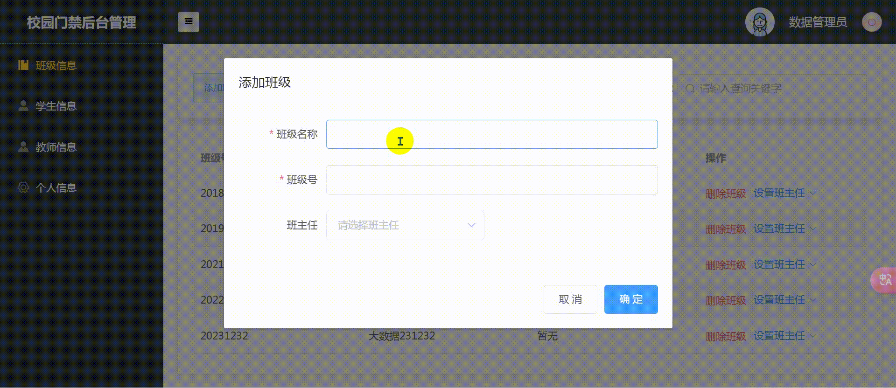
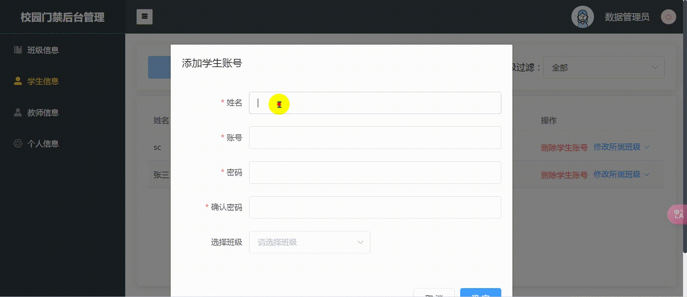
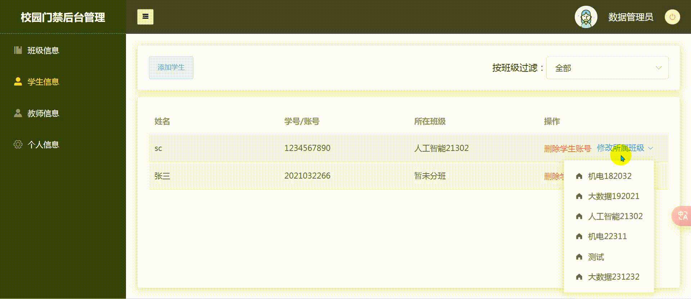

#

## 智能校园门禁管理系统
### 运行效果

### 一、系统综述

该系统基于前后端分离架构设计，集成了先进的人脸识别技术，旨在为校园提供一种智能化的安全管理解决方案。通过微信小程序作为交互界面，系统为教师和学生提供无缝的通行体验。

### 二、详细设计

#### 2.1 系统架构

系统由多个关键组件构成，具体如下：

- **前端用户界面：**
  - **微信小程序**：面向教师和学生，提供人脸数据录入、通行申请和审批功能。
- **后端服务：**
  - **Node.js服务器**：充当数据处理枢纽，负责响应用户请求并与数据库、Python服务器进行数据交换。
  - **Python服务器**：专责图像处理和人脸识别任务，生成并保存特征码。
  - **MySQL数据库服务器**：存储待用的用户信息、人脸特征码以及通行日志。

#### 2.2 系统功能

**微信小程序（学生端）功能：**

- **人脸数据录入**：利用微信小程序API拍摄并上传人脸图像；后端处理后，将结果特征数据存于数据库。
- **通行申请提交**：用户提交通行请求，经教师端审批后，更新数据库中的通行权限数据。

**教师端功能：**

- **申请审批管理**：教师端可查询、审批学生提交的通行申请。

**Web端（出行验证）功能：**

- **人脸认证**：通过Web端摄像头捕获面容图像，后端进行识别并与数据库特征码匹配，以验证通行资格。

**服务器端功能：**

- **Node.js服务器**：提供API接口以响应前端请求，实现与数据库及Python服务器的有效交互。
- **Python服务器**：执行人脸认证算法，比对识别结果与数据库资料，返还校验结果。

**数据库服务器功能：**

- **MySQL数据库**：负责保存用户资料、人脸特征码与通行日志。

**智能校园后台管理系统（Web端）功能：**

- **管理界面**：允许管理员操作教师和学生账户，管理班级和教师关系，以便支撑通行申请与审批过程。

### 三、系统设计理念

本系统采取模块化及高可扩展性设计原则，旨在保障系统的稳定运行与未来升级的灵活性。基于前后端分离策略，该设计能够有效适应用户需求变化，同时确保了系统的高效能和快速响应。

### 四、系统特色

- **易用性**：依托微信小程序的普及性和用户友好性，极大地方便了教师和学生的人脸数据录入及通行权限申请。
- **安全性**：引入最新的人脸识别技术，提升校园通行的安全性能。
- **高效管理**：后端管理系统集成了综合性账户与通行日志管理功能，简化了管理员的监控与维护工作。
